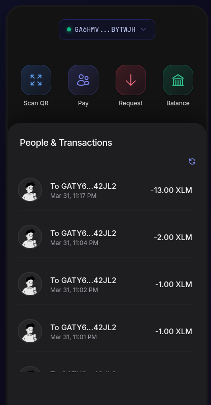
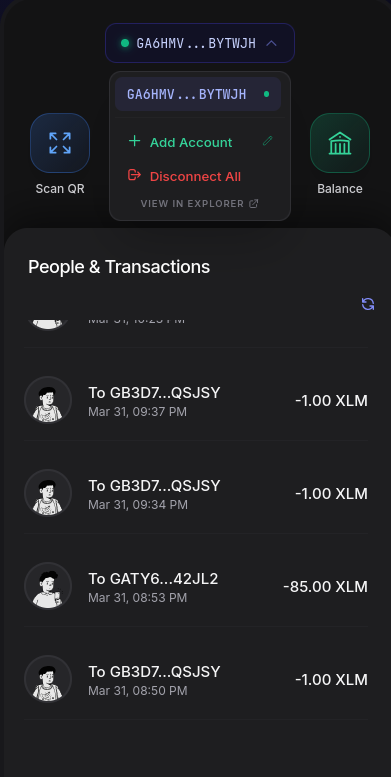
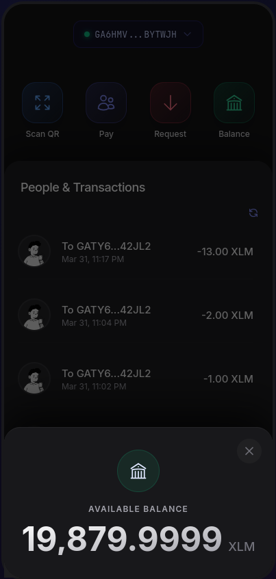
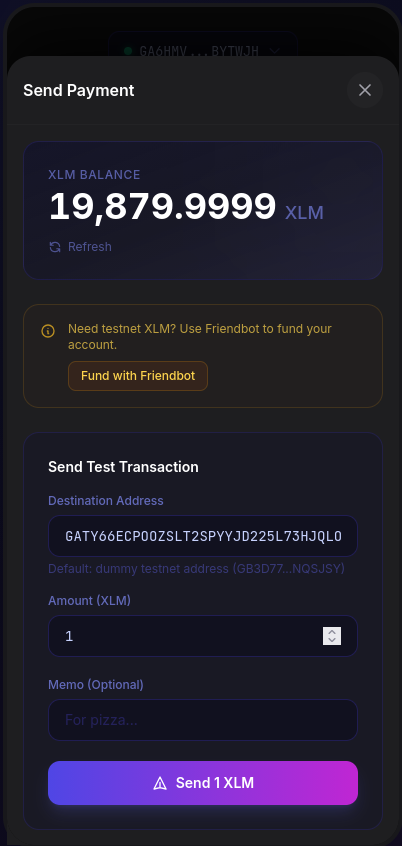
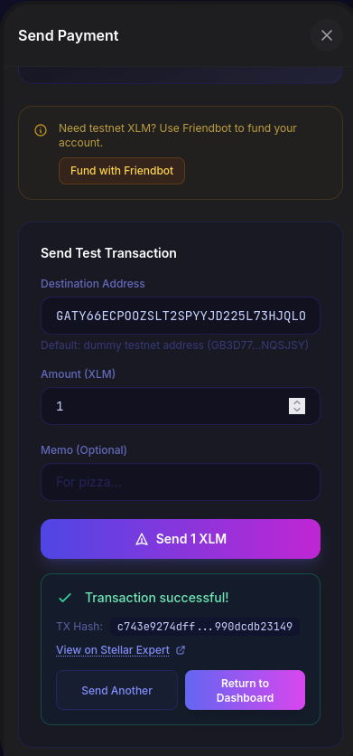

# Stellar Payment Interface

Stellar Payment Interface is a next-generation, mobile-first Web3 decentralized application built on the Stellar network. Designed heavily around modern dark-mode aesthetics (inspired by standard consumer payment apps), it effortlessly bridges the gap between blockchain payments and consumer-friendly UX. Users can scan QR codes, build dynamic transaction requests, view real-time balances, natively sign Testnet transactions through the Freighter wallet, and parse seamless interactive history.

## 🚀 Features
- **Mobile-First UX**: Responsive glassmorphic layout locked to a structurally safe mobile aspect ratio to prevent cross-browser tearing.
- **QR Code Interfacing**: Parse SEP-0007 codes directly from your camera, or instantly generate fully encoded transaction URIs for request sharing.
- **Smart Transactions**: Deep Stellar SDK integration flawlessly handles network execution, parsing network fees, op_underfunded errors, and hash history into a human-readable interface feed.
- **Multi-Account Manager**: Directly bind and shift between multiple Freighter/Local fallback testnet accounts right from an interactive dashboard dropdown.
- **Secure Authentication**: Local 6-digit PIN app wrapper interface to prevent unintended local UI access.

## 🛠️ Setup Instructions

Ensure you have [Node.js](https://nodejs.org/) installed along with the [Freighter Wallet](https://www.freighter.app/) extension in your browser.

1. **Clone the repository**:
   ```bash
   git clone <repository-url>
   cd stellar-dapp
   ```

2. **Install Dependencies**:
   ```bash
   npm install
   ```

3. **Start the Development Server**:
   ```bash
   npm run dev
   ```

4. **Connect Wallet**: 
   Open `http://localhost:3000` in your browser. Set up an initial App PIN, and connect your Freighter wallet automatically. Make sure your Freighter extension is configured to the **Testnet**.

---

## 📸 Application Screenshots

### Wallet Connected State
The primary dashboard unlocks fully authenticated, showing your active wallet connections and the core action layout grid.


### Multi-Account Dropdown Manager
An integrated, smartly engineered dropdown bridging Freighter limitation. It allows you to seamlessly bind, input natively, and hot-swap between multiple unique Testnet identities while persisting them safely locally into your dashboard.


### Balance Displayed
Fetching your Horizon Testnet available XLM balance instantly within an interactive bottom sheet layout.


### Successful Testnet Transaction
Executing a transaction dynamically builds and signs the XDR wrapper, communicating safely with the Stellar Network.


### Transaction Result Display
The UI reacts responsively, catching the finalized transaction status and hash directly to the user before they seamlessly navigate away.


---
*Built organically on the Stellar Testnet for streamlined blockchain UX adoption.*
