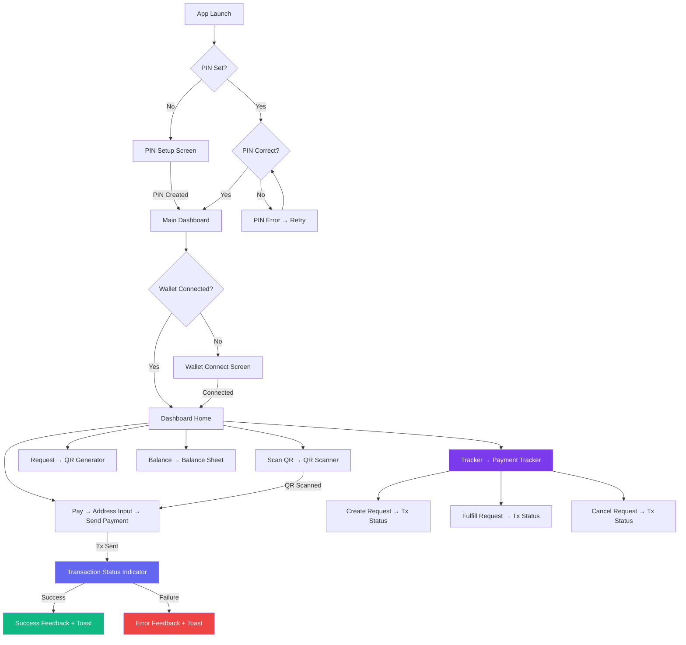

# 🎨 Stellar dApp — Complete UI Specification

> From Level 1 through Level 2: every screen, component, button, and interaction.


---

## 📐 Design System

### Color Palette

| Token | Hex | Usage |
|---|---|---|
| `cosmos-900` | `#0a0a1a` | Page background |
| `cosmos-800` | `#0f0f2e` | Card backgrounds |
| `phone-bg` | `#131314` | Phone frame background |
| `card-bg` | `#1e1e20` | Bottom section / card surfaces |
| `input-bg` | `#18181b` (zinc-900) | Input field backgrounds |
| `stellar-500` | `#6366f1` | Primary accent (indigo) |
| `nebula-500` | `#d946ef` | Secondary accent (pink/purple) |
| `emerald-500` | `#10b981` | Success / received |
| `amber-400` | `#fbbf24` | Warning / pending |
| `red-400` | `#f87171` | Error / cancelled |
| `blue-400` | `#60a5fa` | Info / scan actions |
| `purple-400` | `#c084fc` | Tracker accent (NEW) |

### Typography

| Element | Font | Weight | Size |
|---|---|---|---|
| Section headings | Inter | 600 (semibold) | 18px (`text-lg`) |
| Button labels | Inter | 500 (medium) | 11-12px |
| Body text | Inter | 400 (regular) | 14-15px |
| Wallet addresses | JetBrains Mono | 400 | 11px |
| Balance numbers | Inter | 700 (bold) | 36-48px |
| Small labels | Inter | 500 | 11px uppercase tracking-wider |

### Spacing & Layout

| Property | Value |
|---|---|
| Phone frame | `max-w-[400px]`, `h-[85vh]`, `rounded-[2rem]` |
| Border radius (cards) | `rounded-2xl` (16px) |
| Border radius (buttons) | `rounded-xl` (12px) |
| Border radius (inputs) | `rounded-xl` (12px) |
| Action button icon size | `60×60px`, `rounded-[20px]` |
| Standard padding | `p-4` to `p-6` |
| Bottom sheet radius | `rounded-t-3xl` |

### Animations

| Name | CSS | Duration | Usage |
|---|---|---|---|
| `twinkle` | opacity 0.6→1→0.7 | 8s | Star background |
| `pulse-slow` | scale pulse | 3s | Pulsing elements |
| `glow` | boxShadow intensity | 2s | Active states |
| `float` | translateY 0→-10px | 6s | Floating elements |
| `shimmer` | bgPosition slide | 2s | Loading skeletons |
| `slide-up` | translateY + opacity | 300ms | **NEW** — Bottom sheets, toasts |
| `fade-in` | opacity 0→1 | 200ms | **NEW** — Feed items |
| `step-pulse` | scale + glow | 1.5s | **NEW** — Active tx step |

---

## 🗺️ Navigation Flow



---

## 📱 Screen-by-Screen Specification

---

### Screen 1: PIN Lock Screen

**When shown:** App launch when PIN is set but not yet verified  
**Component:** [PinPad.tsx](file:///home/arjun/Documents/Stellar%20dapp/stellar-dapp/src/components/PinPad.tsx) (EXISTS)  
**Modes:** `setup` | `verify`

| Element | Type | ID | Details |
|---|---|---|---|
| Title | Text | — | "Set Your PIN" (setup) / "Enter PIN" (verify) |
| 6 dot indicators | Visual | — | Filled dots = entered digits, empty = remaining |
| Number pad 1-9, 0 | Buttons | `pin-btn-{n}` | 3×4 grid, `60×60px`, `rounded-full` |
| Backspace | Button | `pin-btn-back` | Bottom-left of pad |
| Error message | Text | — | Red text below dots: "Incorrect PIN." |

**Interactions:**
- Tap digit → fills next dot, subtle scale animation
- 6th digit → auto-submits
- Wrong PIN → dots shake horizontally (300ms), red flash
- Correct PIN → dots pulse green, fade to dashboard

---

### Screen 2: Wallet Connect Screen

**When shown:** After PIN unlock, when no wallet is connected  
**Component:** [WalletConnect.tsx](file:///home/arjun/Documents/Stellar%20dapp/stellar-dapp/src/components/WalletConnect.tsx) (EXISTS)

| Element | Type | ID | Details |
|---|---|---|---|
| App title | Text | — | "Stellar Payment Interface" gradient text |
| Subtitle | Text | — | "Connect your Web3 wallet..." |
| Connect button | Button | `connect-wallet-btn` | Gradient `stellar-600 → nebula-600`, glow shadow |
| Freighter status | Text | — | "Freighter detected ✓" or download link |
| Error message | Text | — | Red text if connection fails |
| Background orb | Visual | — | Blue/purple blur circle, 24×24 |

**States:**
- `disconnected` → Show connect button
- `connecting` → Button shows spinner + "Connecting..."
- `error` → Error message + retry button

---

### Screen 3: Dashboard Home ⭐ (Main Screen)

**When shown:** Wallet connected + PIN unlocked  
**Component:** [Dashboard.tsx](file:///home/arjun/Documents/Stellar%20dapp/stellar-dapp/src/components/Dashboard.tsx) (EXISTS — WILL BE UPDATED)

```
┌──────────────────────────────────────────┐
│  ┌──────────────────────┐ ┌────────────┐ │
│  │ 🟢 GAJN...HEPRVP  ▼ │ │● Testnet   │ │
│  └──────────────────────┘ └────────────┘ │
│                                          │
│  ┌──────┐ ┌──────┐ ┌──────┐ ┌──────┐    │
│  │ 📷   │ │ 👥   │ │ ⬇️   │ │ 🏛️   │    │
│  │ScanQR│ │ Pay  │ │Reqst │ │ Bal  │    │
│  └──────┘ └──────┘ └──────┘ └──────┘    │
│                                          │
│  ┌──────────────────────────────┐ NEW ↓  │
│  │ 📋 Tracker                   │        │
│  │ [count] active requests      │        │
│  └──────────────────────────────┘        │
│                                          │
│  ┌──────────────────────────────────────┐│
│  │ People & Transactions          🔄    ││
│  │                                      ││
│  │ 🟢 Stellar Friendbot  +10,000 XLM   ││
│  │   Apr 15, 11:30 AM                  ││
│  │                                      ││
│  │ 🔴 To GBXY...ABCD      -1.00 XLM    ││
│  │   Apr 14, 3:22 PM                   ││
│  │                                      ││
│  │ 🟢 From GDEF...WXYZ   +50.00 XLM    ││
│  │   Apr 13, 9:05 AM                   ││
│  └──────────────────────────────────────┘│
└──────────────────────────────────────────┘
```

| Element | Type | ID | Details | Status |
|---|---|---|---|---|
| Wallet address pill | Button | `wallet-dropdown` | Truncated address + green dot + chevron | EXISTS |
| Account dropdown | Dropdown | `account-list` | List of saved accounts + "Add Account" input | EXISTS |
| Network badge | Button | `network-badge` | "Stellar Testnet" with pulsing green dot | EXISTS |
| **Action: Scan QR** | Button | `action-scan` | Blue gradient icon box, `60×60px` | EXISTS |
| **Action: Pay** | Button | `action-pay` | Indigo gradient icon box | EXISTS |
| **Action: Request** | Button | `action-request` | Rose gradient icon box | EXISTS |
| **Action: Balance** | Button | `action-balance` | Emerald gradient icon box | EXISTS |
| **Action: Tracker** | Button | `action-tracker` | **NEW** — Purple gradient, wider banner-style | **NEW** |
| Tracker badge | Badge | `tracker-count` | **NEW** — Shows count of active requests | **NEW** |
| Section title | Text | — | "People & Transactions" | EXISTS |
| Refresh button | Button | `refresh-history` | Circular arrow icon | EXISTS |
| Transaction list | List | `tx-history-list` | Scrollable list of tx entries | EXISTS |
| Transaction entry | Link | `tx-{hash}` | Avatar + name/address + amount + timestamp | EXISTS |

**🆕 Changes for L2:**
- Add 5th action: **"Tracker"** — wider banner-style button below the 4-grid
- Add active request count badge on the Tracker button
- Transaction list now includes **contract events** (payment requests created/fulfilled/cancelled)

---

### Screen 4: Payment Tracker 🆕

**When shown:** Tap "Tracker" action button on dashboard  
**Component:** `PaymentTracker.tsx` (NEW)  
**Opens in:** BottomSheet (full-screen)

```
┌──────────────────────────────────────────┐
│  ← Back          Payment Tracker         │
│                                          │
│  ┌─ TAB BAR ──────────────────────────┐  │
│  │ [Create Request]  [My Requests]    │  │
│  └────────────────────────────────────┘  │
│                                          │
│  ─── TAB 1: CREATE REQUEST ───────────── │
│                                          │
│  Recipient Address                       │
│  ┌───────────────────────────────────┐   │
│  │ GABCD...                          │   │
│  └───────────────────────────────────┘   │
│                                          │
│  Amount (XLM)                            │
│  ┌───────────────────────────────────┐   │
│  │ 0.0                               │   │
│  └───────────────────────────────────┘   │
│                                          │
│  Memo (Optional)                         │
│  ┌───────────────────────────────────┐   │
│  │ For dinner...                     │   │
│  └───────────────────────────────────┘   │
│                                          │
│  ┌───────────────────────────────────┐   │
│  │    📋 Create Payment Request      │   │
│  └───────────────────────────────────┘   │
│                                          │
│  ─── TAB 2: MY REQUESTS ─────────────── │
│                                          │
│  ┌──────────────────────────────────┐    │
│  │ 🟡 PENDING         150.00 XLM   │    │
│  │ To: GXYZ...ABCD                  │    │
│  │ Memo: "Dinner split"             │    │
│  │ Created: Apr 22, 11:30 PM        │    │
│  │                                   │    │
│  │ [✓ Fulfill]          [✕ Cancel]   │    │
│  └──────────────────────────────────┘    │
│                                          │
│  ┌──────────────────────────────────┐    │
│  │ ✅ FULFILLED        50.00 XLM    │    │
│  │ To: GDEF...WXYZ                   │    │
│  │ Fulfilled: Apr 21, 5:00 PM       │    │
│  └──────────────────────────────────┘    │
│                                          │
│  ┌──────────────────────────────────┐    │
│  │ ❌ CANCELLED        25.00 XLM    │    │
│  │ To: GHIJ...MNOP                   │    │
│  │ Cancelled: Apr 20, 2:15 PM       │    │
│  └──────────────────────────────────┘    │
└──────────────────────────────────────────┘
```

| Element | Type | ID | Details |
|---|---|---|---|
| Back button | Button | `tracker-back` | `←` icon, top-left |
| Screen title | Text | — | "Payment Tracker" |
| Tab: Create Request | Tab | `tab-create` | Active: white text + bottom border |
| Tab: My Requests | Tab | `tab-requests` | Inactive: zinc-400 text |
| Recipient input | Input | `tracker-recipient` | Monospace, placeholder "G...", validates 56-char |
| Amount input | Input | `tracker-amount` | Number, step 0.1, min 0.0000001 |
| Memo input | Input | `tracker-memo` | Max 28 chars, optional |
| Create button | Button | `create-request-btn` | Purple gradient (`purple-600 → stellar-600`), full width |
| Request card | Card | `request-{id}` | Border-left colored by status |
| Status badge | Badge | `status-{id}` | Yellow (Pending), Green (Fulfilled), Red (Cancelled) |
| Fulfill button | Button | `fulfill-{id}` | Green outline, only on Pending cards own by user |
| Cancel button | Button | `cancel-{id}` | Red outline, only on Pending cards created by user |
| Empty state | Visual | — | Illustration + "No payment requests yet" |

**Status Badge Styles:**
- 🟡 **Pending:** `border-amber-500/30 bg-amber-500/10 text-amber-300`
- ✅ **Fulfilled:** `border-emerald-500/30 bg-emerald-500/10 text-emerald-300`
- ❌ **Cancelled:** `border-red-500/30 bg-red-500/10 text-red-300`

**Request Card Styles:**
- Left border accent matches status color (4px)
- `bg-zinc-900/50 border border-zinc-800/60 rounded-2xl p-4`
- Hover: slight brightness increase

---

### Screen 5: Send Payment (Bottom Sheet)

**When shown:** Tap "Pay" → enter address → "Continue", or QR scan  
**Component:** [TransactionPanel.tsx](file:///home/arjun/Documents/Stellar%20dapp/stellar-dapp/src/components/TransactionPanel.tsx) (EXISTS — WILL BE UPDATED)  
**Opens in:** BottomSheet

| Element | Type | ID | Status |
|---|---|---|---|
| Balance card | Display | — | EXISTS |
| Friendbot funding | Card | `fund-account-btn` | EXISTS |
| Destination input | Input | `tx-destination` | EXISTS |
| Amount input | Input | `tx-amount` | EXISTS |
| Memo input | Input | `tx-memo` | EXISTS |
| Send button | Button | `send-transaction-btn` | EXISTS |
| **Tx Status Indicator** | Component | `tx-status-indicator` | **NEW** — replaces simple spinner |
| Transaction feedback | Component | — | EXISTS (will be enhanced) |

**🆕 Changes for L2:**
- Replace the simple "Processing..." spinner with the **multi-step TxStatusIndicator**
- Add error type classification in feedback

---

### Screen 6: Transaction Status Indicator 🆕

**When shown:** During any transaction (send, create/fulfill/cancel request)  
**Component:** `TxStatusIndicator.tsx` (NEW)  
**Appears:** Inline within TransactionPanel or PaymentTracker

```
┌──────────────────────────────────────────┐
│                                          │
│  ✅ Building Transaction                 │
│  │                                       │
│  ✅ Signing with Wallet                  │
│  │                                       │
│  ⏳ Submitting to Network...             │
│  │  ← pulsing blue glow                 │
│  ○ Confirmed                             │
│                                          │
└──────────────────────────────────────────┘
```

| Step | States | Icon |
|---|---|---|
| Building Transaction | `pending` → `active` → `complete` | 🔨 → ⏳ → ✅ |
| Signing with Wallet | `pending` → `active` → `complete` | ✍️ → ⏳ → ✅ |
| Submitting to Network | `pending` → `active` → `complete` | 📡 → ⏳ → ✅ |
| Confirmed / Failed | `pending` → `complete` / `error` | ⏳ → ✅ / ❌ |

**Visual Spec:**
- Each step: `flex items-center gap-3`
- Connecting line: `w-0.5 h-6 bg-zinc-700` (pending) / `bg-stellar-500` (complete)
- Active step: `text-stellar-300` + pulsing glow ring
- Complete step: `text-emerald-400` + checkmark icon
- Error step: `text-red-400` + X icon + error message below
- Pending step: `text-zinc-600` + empty circle

---

### Screen 7: Toast Notification System 🆕

**When shown:** Real-time events, copy confirmations, errors  
**Component:** `Toast.tsx` (NEW)  
**Position:** Fixed top of viewport, stacks downward

```
┌──────────────────────────────────────────┐
│ ✅ Payment Fulfilled — 150 XLM      ✕   │
│    from GXYZ...ABCD                      │
└──────────────────────────────────────────┘
```

| Variant | Left Border | Icon | Text Color |
|---|---|---|---|
| `success` | `emerald-500` | ✅ checkmark | `emerald-300` |
| `error` | `red-500` | ❌ circle-x | `red-300` |
| `info` | `blue-500` | ℹ️ info | `blue-300` |
| `warning` | `amber-500` | ⚠️ warning | `amber-300` |

**Behavior:**
- Slides in from top: `translateY(-100%) → 0` over 300ms
- Auto-dismiss: 4 seconds (configurable)
- Manual dismiss: ✕ button top-right
- Max 3 visible stacked toasts
- Newest on top, older ones shift down
- `backdrop-blur-md bg-zinc-900/90 border border-zinc-700/50 rounded-xl`

---

### Screen 8: Activity Feed (Enhanced History) 🆕

**When shown:** In the "People & Transactions" section of Dashboard  
**Component:** `ActivityFeed.tsx` (NEW — replaces/augments TransactionHistory)

| Element | Type | ID | Details |
|---|---|---|---|
| Section title | Text | — | "Activity" |
| Live indicator | Badge | `live-badge` | 🔴 pulsing red dot + "LIVE" text |
| Event entry | Card | `event-{id}` | Animated slide-in on new events |
| Event icon | Visual | — | Color-coded per event type |
| Event type | Badge | — | "Payment Sent", "Request Created", etc. |
| Amount | Text | — | Green for received, white for sent |
| Timestamp | Text | — | Relative: "2m ago", "just now" |
| Explorer link | Link | `explorer-{hash}` | Opens Stellar Expert in new tab |
| Empty state | Visual | — | Clock icon + "No activity yet" |

**Event Types & Icons:**

| Event | Icon | Color | Label |
|---|---|---|---|
| Payment Sent | ↗️ arrow up-right | `text-zinc-100` | "Sent" |
| Payment Received | ↙️ arrow down-left | `text-emerald-400` | "Received" |
| Request Created | ➕ plus | `text-purple-400` | "Request Created" |
| Request Fulfilled | ✅ check | `text-emerald-400` | "Fulfilled" |
| Request Cancelled | ✕ x-mark | `text-red-400` | "Cancelled" |
| Account Created | ⭐ star | `text-amber-400` | "Account Funded" |

**New event animation:**
- Entry slides in from right: `translateX(20px) + opacity 0 → 0 + 1`
- Subtle highlight glow for 2 seconds on new entries
- Chronological order, newest first

---

### Existing Screens (Unchanged from L1)

| Screen | Component | Trigger | Notes |
|---|---|---|---|
| **QR Scanner** | [QRScanner.tsx](file:///home/arjun/Documents/Stellar%20dapp/stellar-dapp/src/components/QRScanner.tsx) | Tap "Scan QR" | Full-screen camera overlay |
| **Address Input** | Inline in [Dashboard.tsx](file:///home/arjun/Documents/Stellar%20dapp/stellar-dapp/src/components/Dashboard.tsx) | Tap "Pay" | BottomSheet with G... input |
| **Balance Sheet** | Inline in [Dashboard.tsx](file:///home/arjun/Documents/Stellar%20dapp/stellar-dapp/src/components/Dashboard.tsx) | Tap "Balance" | Large XLM number + "Available Balance" label |
| **Request/Receive** | Inline in [Dashboard.tsx](file:///home/arjun/Documents/Stellar%20dapp/stellar-dapp/src/components/Dashboard.tsx) | Tap "Request" | QR code generator + amount/memo inputs |

---

## 🧩 Complete Component Inventory

### Existing (L1) — 9 Components

| Component | File | Size | Role |
|---|---|---|---|
| [Dashboard](file:///home/arjun/Documents/Stellar%20dapp/stellar-dapp/src/components/Dashboard.tsx#24-340) | [Dashboard.tsx](file:///home/arjun/Documents/Stellar%20dapp/stellar-dapp/src/components/Dashboard.tsx) | 17KB | Main layout orchestrator |
| `WalletConnect` | [WalletConnect.tsx](file:///home/arjun/Documents/Stellar%20dapp/stellar-dapp/src/components/WalletConnect.tsx) | 11KB | Account dropdown + connect UI |
| [TransactionPanel](file:///home/arjun/Documents/Stellar%20dapp/stellar-dapp/src/components/TransactionPanel.tsx#26-328) | [TransactionPanel.tsx](file:///home/arjun/Documents/Stellar%20dapp/stellar-dapp/src/components/TransactionPanel.tsx) | 12KB | Send payment form |
| `TransactionFeedback` | [TransactionFeedback.tsx](file:///home/arjun/Documents/Stellar%20dapp/stellar-dapp/src/components/TransactionFeedback.tsx) | 6KB | Success/error display |
| [TransactionHistory](file:///home/arjun/Documents/Stellar%20dapp/stellar-dapp/src/components/TransactionHistory.tsx#9-100) | [TransactionHistory.tsx](file:///home/arjun/Documents/Stellar%20dapp/stellar-dapp/src/components/TransactionHistory.tsx) | 4KB | Payment history list |
| `PinPad` | [PinPad.tsx](file:///home/arjun/Documents/Stellar%20dapp/stellar-dapp/src/components/PinPad.tsx) | 4KB | PIN setup/verify |
| `QRScanner` | [QRScanner.tsx](file:///home/arjun/Documents/Stellar%20dapp/stellar-dapp/src/components/QRScanner.tsx) | 1.5KB | Camera QR reader |
| `BottomSheet` | [BottomSheet.tsx](file:///home/arjun/Documents/Stellar%20dapp/stellar-dapp/src/components/BottomSheet.tsx) | 1.9KB | Slide-up panel wrapper |
| [NetworkBadge](file:///home/arjun/Documents/Stellar%20dapp/stellar-dapp/src/components/NetworkBadge.tsx#7-29) | [NetworkBadge.tsx](file:///home/arjun/Documents/Stellar%20dapp/stellar-dapp/src/components/NetworkBadge.tsx) | 1.2KB | Testnet/Mainnet toggle |

### New (L2) — 4 Components

| Component | File | Role |
|---|---|---|
| `PaymentTracker` | `PaymentTracker.tsx` | **Create/manage on-chain payment requests** |
| `TxStatusIndicator` | `TxStatusIndicator.tsx` | **Multi-step transaction progress** |
| `ActivityFeed` | `ActivityFeed.tsx` | **Real-time event stream (replaces TransactionHistory)** |
| `Toast` | `Toast.tsx` | **Notification toast system** |

---

## 🚨 Error Handling UI

### 3+ Distinct Error Types with Unique UI

| Error Type | Visual Treatment | Example Messages |
|---|---|---|
| **Contract Error** | Purple/indigo border card, 📋 icon | "Payment request not found", "Request already fulfilled", "Unauthorized: only creator can cancel" |
| **Network Error** | Red border card, 🌐 icon | "Network timeout — please retry", "Horizon server unavailable", "Transaction expired (tx_too_late)" |
| **Validation Error** | Amber border card, ⚠️ icon + inline field highlight | "Invalid address format", "Insufficient XLM balance", "Amount must be greater than 0" |

**Inline field validation:**
- Invalid input → `border-red-500/50` + red text below field
- Shake animation (200ms) on submit with invalid fields

**Error in TransactionFeedback:**
- Error type badge (Contract / Network / Validation)
- Human-readable message
- "Try Again" button
- Optional: "View Details" expandable with raw error

---

## 🔘 Button States Reference

Every interactive button follows this state pattern:

| State | Visual |
|---|---|
| Default | Base gradient/color |
| Hover | `brightness-110` + `scale-105` + enhanced shadow |
| Active/Pressed | `scale-[0.98]` (slight shrink) |
| Disabled | `opacity-50` + `cursor-not-allowed` + no shadow |
| Loading | Content replaced with spinner + "Processing..." |

---

## 📱 Responsive Breakpoints

| Width | Behavior |
|---|---|
| < 400px | Phone frame fills entire width |
| 400-768px | Phone frame centered, `max-w-[400px]` |
| > 768px | Phone frame centered in cosmic background |

> [!NOTE]
> The app is **mobile-first by design** — it renders as a phone-shaped card centered on desktop. This is intentional to match the payment app UX paradigm.
